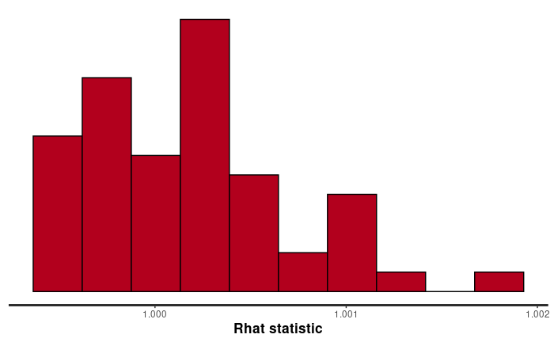
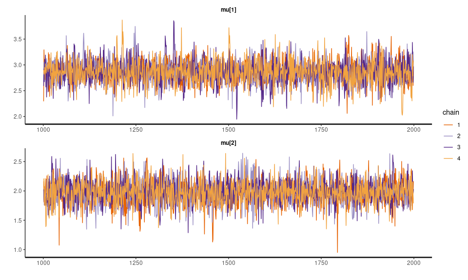
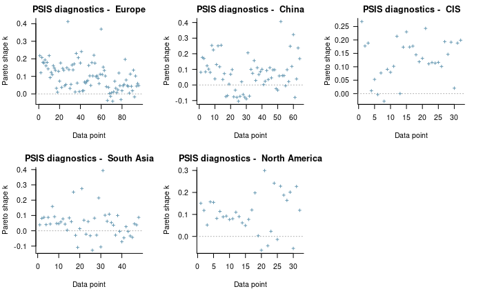
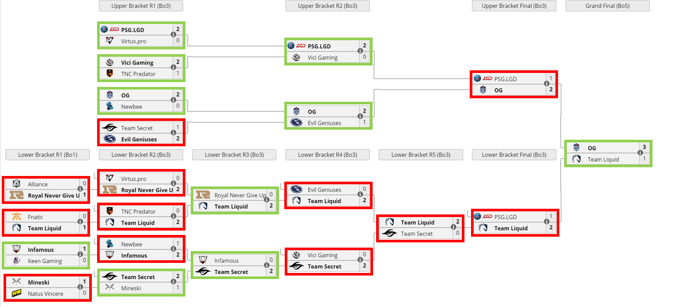
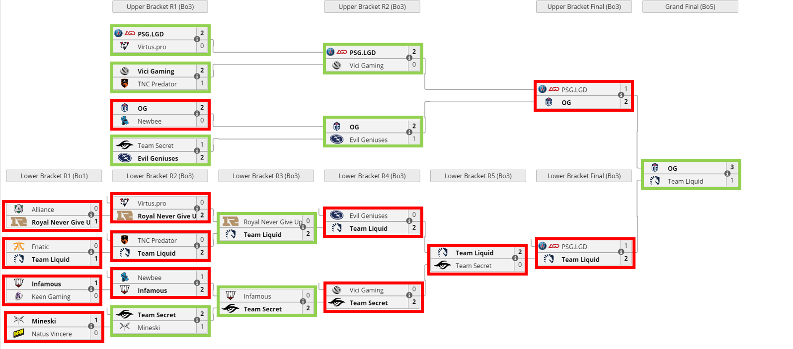

\newpage

```{r setup, include=FALSE}
knitr::opts_chunk$set(echo = TRUE)
library(tidyverse)
library(rstan)
library(knitr)
library(dplyr)
library(loo)
```

# Introduction

In this report, we present a Bayesian Analysis approach for evaluating team performances for the esport *Dota 2*. This topic was chosen due to the personal interest of our team members in esports. We formed the group based on this and all of us were familiar with either Dota 2 or League of Legends. 

Before describing the problem more thouroughly, we would like to provide a brief insight into what we are trying to achieve. Dota 2 is a MOBA game and an esports discipline. Esports have a similar structure as traditional sports, where there are professional seasons which roughly equal to a year, and these are finished with a main tournament (in our case: *The International (TI)*). 

The tournament itself consists of two stages: qualifications and main event. The latter is also split into two parts: group stage, and play-offs. During the group stage, teams compete in order to have a better starting position in the play-off stage. For our analysis, we used the data from the last TI where the best teams in the world competed.

The professional Dota 2 scene is divided into different regions (e.g. Europe, CIS, China, etc). Teams from these regions participate in qualifications separately, and the very first goal of the team is to become the best within their region. As a result, teams from one region play with each other much more often, and it can influence the way they perform. Hence, we also used information about the region of the teams while designing and implementing our models.

Our aim is to find a way to predict the match result based on the performances of the competing teams (the way performances are computed is discussed later). In other words, we propose a way to make the analysis of the previous matches in which teams participated, and take those results to predict how they would perform in the future.

# Data and Preprocessing

In our analysis, we decided to use matches from **The International 2019** Tournament, the results of which are available online through some APIs. The data was gathered with the Python programming language in two steps. At first, match IDs were collected from [DotaBuff](https://www.dotabuff.com/esports/events/284-ti9-group-main). Afterwards, we used the obtained IDs in order to acquire detailed information about each match. For the latter we used the [OpenDota API](https://docs.opendota.com/#tag/matches).

For our analysis, we used the data from the group stage of the tournament as each team played the same amount of matches. On the other hand, for the posterior predictive checks (which are further discussed in the [Posterior Predictive Checks](#posterior-predictive-checks) section), we made predictions for the play-off stage of TI9. 

The next step was to define a new metric in order to quantify the teams' performances. To do this we used a mixture of different measures/scores which we then normalized and used its sum. The initial features can be seen below:

```{r var_table, echo=FALSE}
variable <- c("radiant_score", "dire_score", "radiant_xp_adv", "radiant_gold_adv", 
              "hero_damage", "hero_healing", "obs_placed", "kda")
description <- c("Final score for the Radiant team(number of kills on Radiant)", 
                 "Final score for the Dire team (number of kills on Dire)", 
                 "Array of the Radiant experience advantage at each \\
                     minute in the game. A negative number means that \\
                     Radiant is behind, and thus it is their experience disadvantage.",
                 "Array of the Radiant gold advantage at each minute in the game. \\
                     A negative number means that Radiant is behind, and thus it is \\
                     their gold disadvantage.", "Hero Damage Dealt (user specific)", 
                 "Hero Healing Done (user specific)", 
                 "Total number of observer wards placed (user specific)", 
                 "kda (ratio of kills/deaths/assists) (user specific)")

knitr::kable(data.frame(variable, description), format = 'pipe', padding=100,
             col.names = c("Variable Names", "Description"))
```

These features were extracted for each match and contain information about both of the teams. Since each $Dota 2$ game consists of $5$ players, this means that we end up with $10$ data points for each match. 

As you can see from the table above, the first $4$ features have to do with team-wide statistics while the rest $4$ have to do with user-specific statistics since they evaluate the performance of each player separately. Our goal is to find a way to combine these features so that the result will be a performance score for each team, for each match. 

Our approach to this can be described by the following equation which assigns a score to each team for each match:
$$
R_{score} = score\_gap + exp\_advantage + gold\_advantage + 
$$
$$
\sum_{\forall p \in P_{R}} hero\_damage(p) + healing\_done(p) + kda(p) + wards\_placed(p)
$$

where $R_{score}$ denotes the radiant team score, and $P_R$ is the set of all radiant players on the specific match. The same was also applied for the dire team.

*NOTE: This equation is over-simplified since it does not take normalization into account (having all values in the same range).*

Each of these functions is described below:
```{r var_table_matches, echo=FALSE}
match_vars <- c("score_gap", "exp_advantage", "gold_advantage", "hero_damage", 
              "healing_done", "kda", "wards_placed")
match_vars_desc <- c("Radiant score minus Dire score (so it can also be negative).", 
                 "A weighted sum of the experience advantage that Radiant had during \\
                     the game (can also be negative). We are giving bigger weights \\
                     to the scores at the end of the game since they are more \\
                     informative about the final result.", 
                 "A weighted sum of the gold advantage that Radiant had during \\
                     the game (can also be negative). We are giving bigger weights \\
                     to the scores at the end of the game since they are more \\
                     informative about the final result.", 
                 "Simplistic Approach: The difference of the sum of the damage dealt by \\
                 all Radiant players when compared to Dire players.", 
                 "Simplistic Approach: The difference of the sum of the healing that \\
                 was done by all Radiant players when compared to Dire players.", 
                 "Simplistic Approach: The difference of the sum of kdas of \\
                 all Radiant players when compared to Dire players.", 
                 "Simplistic Approach: The difference of the sum of the number of \\
                 observation wards that were placed by all Radiant players when \\
                 compared to Dire players.")

knitr::kable(data.frame(match_vars, match_vars_desc), format = 'pipe', padding=100,
             col.names = c("Variable Names", "Description"))
```

As you can see, a rather simplistic approach was used to combine the data. As a normalization technique we are currently using MinMax scaling which does not completely distort our values and so it will keep the following notion:

- Large performance scores should probably result in a Radiant win (not always).
- Smaller scores (negative ones) should point us to the direction that Dire will most probably win.

For more information about the implementation you may check the [data transformation appendix](#data-transformation). An important note here is that, for each match, the $score\_gap$, $exp\_gap$ and $gold\_advantage$ columns for the Dire team are multiplied by $-1$ so that they will be positive in case the Dire has positive statistics (and negative otherwise). 

# Model Architectures

By preprocessing our data we managed to get a single scoring measurement for each team. Our next step is to build a model on top of these transformed data and try to predict/sample future scores (future performances). Our approach invloved two models which are going to be described below. For the implementation we used the RStan [@rstan] package of R.

At first, we are going to represent our data as a 2-dimensional array which will contain information about each team. The rows will denote the matches and the columns will denote the teams, while the content of each array cell will be the above computed performance scores.


Below, we are going to describe two model-architecture approaches, hierarchical and separate models. In the first case, under the hierarchical normal model, we assume that our data (Dota 2 matches per team for each region) are independently normally distributed within a certain number of groups (which is equal to the number of teams that each region has).Here, all groups share a common variance $\sigma^2$ while they have different (team-specific) means $\theta_j$ [@gelman2013bayesian]. We also assume that the means follow a certain distribution (disccussed in the [next section](#choice-of-priors)) with unknown mean $\theta_{\mu}$ and standard deviation $\theta_{\sigma}$.

In the case of separate models, we assume that each team has its own model and so we will build separate models which will contain no other information other than the performances of the teams on their matches. To implement that, we use separate priors $\theta_j$ and $\sigma_j$ for each of the teams.


## Choice of Priors

Our first trials consisted of trivial priors which contain no problem-specific information, meaning that we did not use any current knowledge while picking them. The reason we chose these weakly informative priors is because we did not want to use current knowledge since it would skew our results towards a certain assumption which would not hold in the general case.

While tuning these weakly informative priors we noticed that the results and the output diagnostics were mostly the same. This made us stay with the choices above since these weakly informative priors showed some stability. In the [Prior Sensitivity Analysis section]($prior-sensitivity-analysis) we are also going to discuss on how using informative priors affects the results.

In our problem we represent our observed performances by $y_{ij}$, where $i=1..N$ denotes the current match and $j$ corresponds to the team of a certain region. So $y_{ij}$ is the performance score of team j in game i. We can now mathematically express the separate model as:
$$
y_{ij} \sim N(\mu_j, \sigma_j)
$$
$$
\mu_j \sim N(0, 100)
$$
$$
\sigma_j \sim Inv-\chi^2(0.1)
$$


For the hierarchical model these weakly informative priors can be mathematically expressed as follows:

$$
y_{ij} \sim N(\theta_j, \sigma)
$$

$$
\theta_{\mu} \sim N(0, 100)
$$
$$
\theta_{\sigma} \sim inv-\chi^2(0.1)
$$
$$
\theta_j \sim N(\theta_{\mu}, \theta_{\sigma})
$$
$$
\sigma \sim inv-\chi^2(0.1)
$$


In the representations $\theta_{\mu}$ and $\theta_{\sigma}$ are the hyper-priors of the means (and the means are denoted as $\theta_j$ for each team).


## Separate Model

Firstly, we built a separate model which could reflect each team performance separately. The idea behind the separate model is that all teams are unique and there is nothing common with them. This contradicts with our hypothesis that teams from different regions tend to have different gameplays and strategies (e.g. teams from region $X$ might follow a more offensive gameplay). 

In the separate model, each team is going to have their own mean and variance. This means that, when we later reach the prediction stage, we cannot make any predictions about unseen teams (this is not a problem in our case) and we can also not extract any generic information about the gameplay and the strategies.


### Using the model
You may find the stan implementation of the separate model in the [appendix (Stan Code)](#separate-model-impementation). Now in order to run the separate model on our dataset we are using the following R code:

```{r,results='hide',message=FALSE,warning=FALSE}
data <- read.csv(file = './data/match_performance_group_region.csv')  # read dataset

sm <- rstan::stan_model(file = './model/Separate.stan')  # load model
stan_data <- list(y = data,  # team performances
                  N = nrow(data),  # number of matches of each team
                  J = ncol(data))  # number of teams
model_sm <- rstan::sampling(sm, data = stan_data,
                            chains=5
                            ) # load data to our model and compile

draws_sm <- as.data.frame(model_sm)  # convert to data frame
```

From the above code you can see that we used the default configurations for compiling stan models with the exception of the `chains` parameter which is set to $5$ instead of the default $4$. This means that we are running $5$ chains and for each chain we do $2000$ iterations and we prune the first $1000$ (warm-up iterations) since these are the default values.

## Hierarchical Model

The goal here is to create a hierarchical model for the teams of each region. As we have already mentioned above, we can divide the 18 teams to six regions (Europe, China, CIS, Southeast Asia, North America, South America). By doing that we get different posterior samples for the teams of each region and this can later help us define how different is the gameplay and the strategies used in each region. 

Now, in order to build the models, we are going to use the same hierarchical structure for all different regions. This way we are sure that there is no external bias. 

### Using the Model
You may find the stan implementation of the hierarchical model in the [appendix (Stan Code)](#hierarchical-model-impementation). Here, for each region, we run the hierarchical model on its data set points (the matches of the teams of that region). For example, in the Europe region, we have the team Alliance, CHAOS, OG, NiP, Secret, Liquid to form the data set. 

```r
hm <- rstan::stan_model(file = './model/Region-Hierarchical.stan')
Europe_data <- list(y = data[,1:6],  # the observed performances
                    N = nrow(data[,1:6]),  # number of teams
                    J = ncol(data[,1:6]))  # number of matches
# compile the model with a standard seed
model_Europe_hm <- rstan::sampling(hm, data = Europe_data, 
                                   chains=5, seed=42)
draws_Europe_hm <- as.data.frame(model_Europe_hm)
```

Again, you can see that we used the default parameters of stan and that is true for every hierarchical model of every region. 

# Convergence Diagnostics

Our basic method of checking for convergence was using the $\hat{R}$ diagnostic. For the implementation we used rstan's [@rstan] Rhat function which compares the between and the withing-chain estimates of the model parameters and other univariate quantities of interest. 

An $\hat{R}$ value larger than $1$ means that the chains have not mixed well and that they don't converge to a common distribution (so the between and within-chain estimates don't agree). On the other hand, values really close to $1$ are good indicators of convergence of the chains. 

## $\hat{R}$ Results


### Separate Model

For the separate model we ended up with and $\hat{R}$ value of 1 for all of the parameters (these include 18 $\mu$ parameters and 18 $\sigma$ parameters, one for each team). This implies that our chains converge to a common distribution which is what we aimed for. 


The $\hat{R}$ plot below shows the values that $\hat{R}$ has taken for the separate model:




As you can see, the largest Rhat value is still smaller than $1.002$. In addition, in the figure below you can also see how the values of the posterior samples for $\theta_1$ and $\theta_2$ are evolving (after removing the warm-up iterations).




### Hierarchical Model

With the above weakly informative priors we managed to reach converge after compiling 5 stan models (one for each region). The $\hat{R}$ values have a similar distribution as above. In particular, all of the $\hat{R}$ values (rounded to 3 decimals) had a value of 1 which means that we reached convergence again. 

Here, it is worth mentioning that the North American region has only one team participating the TI which means that only one team defines a whole region. Ideally we would need more information about the region before performing the modeling.


## Effective Sample Size

Since the number of posterior parameters is too large, we cannot include the effective sample size for each one of them. In general, an effective sample size (ESS) greater than 100 (per chain) is considered good. In our case, we used the Bulk and Tail ESSs and we got values close to $5000$ for each parameters for both the separate model and the hierarchical ones. This is a good indicator that our posterior estimates are reliable.

## HMC Diagnostics

While running the separate model, there were no divergent transitions after the warm-up, meaning that the validity concern is not broken. Hence, it was unnessary to adjust the `adapt_delta` control parameter, and in the model, the standard $0.8$ target Metropolis acceptance rate was used. Also, there were no problems with the maximum `treedepth`. So, it is possible to say that the model is also efficient.

Speaking about the hierarchical model, the number of divergent transitions after the warm-up was relatively small (all values were in a range from $0$ to $20$). To fix this, we tried to use the `adapt_delta` parameter. However, even with the acceptance rate close to $1$, the divergent transitions were still present. This means that there are problems with validity but as the number is close to zero, it can be considered insignificant.


# Model Comparison

For the hierarchical model we can get the PSIS-LOO elpd values with the following R code:
```{r,results='hide',warning='hide',message='hide'}
sm_log_lik <- extract_log_lik(model_sm, merge_chains = FALSE)
sm_r_eff <- relative_eff(exp(sm_log_lik), cores = 2)
sm_loo <- loo(sm_log_lik, r_eff = sm_r_eff, cores = 2)
```

```{r}
sm_loo$estimates
```

Then by using a for loop we can also get the PSIS-LOO elpd values for each hierarchical model as follows:
```r
models_list <- list(model_Europe_hm, model_China_hm, model_CIS_hm, 
                    model_SAsia_hm, model_NA_hm)
for (i in 1: length(models_list)) {
  # k values are high for 7% of data
  lls <- extract_log_lik(models_list[[i]], merge_chains = FALSE)
  m_reff <- relative_eff(exp(lls), cores = 2)
  m_loo <- loo(lls, r_eff = m_reff, cores = 2)
  cat("Model", i, "loo:")
  print(m_loo)
}
```

In order to avoid noise, we are going to show the output values in a table:

| Region/Model  | PSIS-LOO elpd | SE  |
|---------------|---------------|-----|
| Europe        | -108.4        | 7.6 |
| China         | -66.7         | 5.4 |
| CIS           | -38.1         | 2.2 |
| South Asia    | -66.3         | 3.9 |
| North America | -42.3         | 2.7 |

Here we can see that the highest PSIS-LOO value is that of the the hierarchical model of the CIS region. In general, the hierarchical model is associated with better elpd values.

In order to assess the above, we are going to use the corresponding $\hat{k}$ values for each model.

## Reliability

For the separate model, the $\hat{k}$ values can be visualized as follows:

```{r}
plot(sm_loo, diagnostic = c("k", "n_eff"),
      label_points = FALSE,main = "PSIS diagnostics for the Separate Model" )
```


while for the hierarchical models we have the following diagnostics (for each region):

```r
models_list <- list(model_Europe_hm, model_China_hm, 
                    model_CIS_hm, model_SAsia_hm, model_NA_hm)
model_names <- list("Europe", "China", "CIS", "South Asia", "North America")
par(mfrow = c(2, 3))
for (i in 1: length(models_list)) {
  lls <- extract_log_lik(models_list[[i]], merge_chains = FALSE)
  m_reff <- relative_eff(exp(lls), cores = 2)
  m_loo <- loo(lls, r_eff = m_reff, cores = 2)
  plot(m_loo, diagnostic = c("k", "n_eff"),
      label_points = FALSE,main = paste("PSIS diagnostics - ", model_names[[i]]) )
}
```



As you can see, the separate model has a lot more $\hat{k}$ values that are above $0.5$ which is an indicator that the results cannot be trusted. On the other hand, the $\hat{k}$ values for the hierarchical models are all below $0.5$ which means that the result is reliable.


## Ranking the Models

Here we are going to compare the separate model with the hierarchical one. An important note here is that the hierarchical model architecture contains many hierarchical models for each region but, all of these models are dependent with each other and so we treat them as one. 

The above fact results in an issue when comparing the models. The problem here is that since the hierarchical models are region-specific then there is a non-fixed amount of data points (matches) for each of them. This means that by using the elpd values above, we are ignoring the facts that the two models (separate and hierarchical) have seen different kind of observations.

Below, we are going to present the final model ranking but keep in mind that the result in not $100\%$ trustworthy due to the fact mentioned above (the difference columsn have to do with the difference when compared to the top-ranked model):

| Ranking | Model                      | ELPD       | ELPD Difference | SE Difference |
|---------|----------------------------|------------|-----------------|---------------|
| 1.      | CIS-Hierarchical           | -38.1      | 0.0             | 0.0           |
| 2.      | North America-Hierarchical | -42.3      | 4.2             | 0.5           |
| 3.      | South Asia-Hierarchical    | -66.3      | 28.2            | 1.7           |
| 4.      | Chinese-Hierarchical       | -66.7      | 28.6            | 3.2           |
| 5.      | Europe-Hierarchical        | -108.4     | 70.3            | 5.4           |
| 6.      | Separate                   | -346.38691 | 307.9           | 10.56         |


Here, we can see that the hierarchical models that had to do with regions for which we have a small number of teams, are ranked higher, while regions such as Europe and China that have the biggest percentage of teams are ranked lower. 

This shows the relationship between the number of data points and the elpd values and this is also an indicator that the above results cannot be used in order to compare the hierarchical model with the separate model. Instead, we could maybe use the sum of the elpd values of the hierachical models as a representative value. If we did that we would end up with a PSIS-LOO elpd value of $-321.8$. This modified elpd value is still better than the value for the separate model and we could use that as a better indicator for comparing the two model architectures.

But still, in the previous subsection we saw that the $\hat{k}$ values for the separate model were rather high which means that the above ranking is not completely reliable. In the next section we are going to discuss the performance of the models on new data.


# Posterior Predictive Checks

## Extracting Results
The prediction workflow for a series match between team $X$ and $Y$ is the following: 

1. A normal series is a two out of three game series. But here we only compare each team's expected performance scores to predict who is more likely to win in the series.

2. The $ypred$ in the stan code represents the predictive performance score of each team. So, by comparing the $ypred$ of team $X$ and $Y$, we could get the win possibility. The function `predict_result_sm` below will do this:
```{r}
predict_result_sm <- function(team_num_1, team_num_2) {
  ypred_1 <- draws_sm[, 36 + team_num_1]
  ypred_2 <- draws_sm[, 36 + team_num_2]
  win_rate_1 = {}
  for (i in 1:length(ypred_1)) {
    win_rate_1[i] = ypred_1[i] / (ypred_1[i] + ypred_2[i])
  }
  
  mean_rate_1 <- (mean(win_rate_1))
  
  return(mean_rate_1)
}
```

3. If the win possibility of team $X$ is above 0.5, we will say that the team $X$ is more likely to win in this game series.

Here is an example to predict which team will win between PSG.LGD and VP.
```{r}
#return the win team
compare <- function(team_name_1,team_name_2){
  team_num_1 <- which(colnames(data) == team_name_1)
  team_num_2 <- which(colnames(data) == team_name_2)
  predict <- predict_result_sm(team_num_1,team_num_2)
  if(predict>=0.5)
    return(team_name_1)
  else 
    return(team_name_2)
}

#Calculate the result of main event stage
compare("PSG.LGD","VP")
```

We actually apply this method to all of the series in the main event. Here are the prediction result compared to the real ones. The green boxes indicate that the predictions correspond to the actual results, while red boxes indicate that the predictions do not correspond to the actual results (missclassification).

Predictive Performance of the separate model: 



From the above image we can see that we reached an accuracy of $45.5\%$ with the separate model.


Predictive Performance of the hierarchical model:  



Here we can see that the accuracy is almost $41\%$ which is lower than the separate model.

## Analysis
As you can see, there is no significant difference in the results between the separate model and the hierarchical model. This proves that regional factors do not play a significant role. In other words, there are no significant differences between the teams in the different regions.

Above, we can see that the models fail to predict the results for Team Liquid most of the time. However, this can be explained since the performance of the team during TI9 was discussed a lot. The team changed its roster two months before the tournament which is not a common situation. Therefore, during the group stage, the performance was unstable but during the play-offs it improved in times.

Also, the bad results were shown for the first round of the lower bracket. It is known as a “roulette” since these matches are completed in a best-of-1 format meaning that they consist only of 1 game whereas other matches are either best-of-3 or best-of-5. 


It is also worth mentioning that the prediction accuracy is not very high. Possible reasons are the following:

1. We just predict the main event result based on group stage performance. It often happens that a team is in poor form in the group stage, but gets better and better in the knockout stages (just like in normal sports). With this type of teams, our predictions are difficult to be accurate. For example, as mentioned above, Team Liquid was in the 14th spot out of all teams in the group stage, but in the end it finished at second place. So we were almost entirely wrong in our predictions for this team.

2. Our performance score/metric is not ideal and does not completely reflect the power of each team. This is discussed in more detail in the [improvements section](#discussion-of-issues-and-possible-improvements).

# Prior Sensitivity Analysis

As mentioned [above](#choice-of-priors), trying out different weakly informative priors yielded similar results and the models converged in all cases. Below we are going to mention the results for another choice of priors which is considered more informative. 

## Separate Model

Here, we chose to use the mean performance score and its standard deviation from the gathered data as our prior for the mean and sigma of the separate model, respectively.

Mathematicaly this can be denoted as:
$$\mu_j \sim N(\mu_0, \sigma_0)$$

where $\mu_0$ denotes the mean performance score for the gathered data, and $\sigma_0$ stands for standard deviation of the data.

The standard deviation for the sampling is now 
$$
\sigma_j \sim inv-\chi^2(\sigma_{new})
$$
where $\sigma_{new}$ is drawn from $\mu_0 - N(\mu_0, \sigma_0)$.

The above configuration resulted in an accuracy of $52.5\%$ (correctly predicted 12 out of 22 matches).


## Hierarchical Model
For the hierarchical model, we used the following mathematical notation:

$$
\theta_{\mu} \sim N(\mu_0, \sigma_0)
$$

$$
\theta_{\sigma} \sim inv-\chi^2(\sigma_{new})
$$
where the $\sigma_{new}$ was drawn in the same way as in the case of the separate model. 


The above configuration resulted in an accuracy of $52.5\%$ (correctly predicted 12 out of 22 matches) which is the same as with the separate model.


# Discussion of Issues and Possible Improvements
From the above results, we can see that there is a large number of issues and improvements can be made in the current work.

1. The data from the group stage matches does not fully reflect the ability of the teams (like in the Team Liquid example), so we should also include the previous performance of each team in the database. Getting further information about each team's performances is crucial since the whole prediction process is based on that.
    - Here, we need to be careful with what data we choose. Just like in normal sports, the team members of e-sports teams are not always the same and transfers happen from time to time.
    - This means that we should also take that factor into account. A possible solution would be to completely separate the individual players' performances so that each team's performance is not tied to games on which the team is always the same, but it is tied to the games that each player of the team has played. This way each team's performance could be the sum of its players' performances irregardless of whether they play on the same team or not.
    - The above is a nice way to gather more data but does not take into account the fact that teamwork is also an important part of e-sports (how players collaborate with each-other). 

2. The method of adding up all the parameters to get a performance score is too simple. Perhaps we should find a more accurate way of representing the performance of the individual teams. 
    - For example, by assigning different weights to performance indicators based on group stage ranking, so that the final score matches their actually performance.
    - Another approach would be to follow the note of the previous bullet (that teams are not always the same) and gather more data by using player-specific knowledge.
  
# Conclusion

Above we described a way to predict future statistics about Dota 2 matches by using a very small dataset. By using Bayesian Analysis we managed to extract predictions about match outcomes and compare the gameplay of the teams of each region. 

The results may not be ideal but there is room for improvement and we did not reach a dead end. In the previous paragraph we mentioned what steps could lead us to better results and how to overcome the low amount of prior information. By following these steps, we believe that we can achieve much greater accuracy and better models overall.

In addition, we saw how separate and hierarchical models are compared and discussed their strengths and weaknesses. These models helped us predict the results of the TI and the latter can also help us extract gameplay specific information. For example, by destructuring the performance scores we could see that higher performance scores mostly correspond to offensive teams and so we could use that assumption in order to predict gameplay styles for each region. We decided not to include the above since it was based on a big assumption and our data transformation could not guarantee that this holds (large performance values match to offensive teams). 

In general, the above report includes a basic and straightforward approach to perform Bayesian Analysis on multidimensional data by transforming the data and using team performances as "quality" indicators. Since our prior information concluded of a very small number of matches for each team, we can say that the results are sensible while there is still room for improvement both in our data and model choices.

# Self-Reflection

## Rongzhi Liu

There are many things in life that cannot be accurately and simply measured by a number, such as how much he loves me. This work made me realize that it is sometimes more difficult to get the right data than it is to analyze it using Bayesian theory. In practice, there is a wide range of knowledge to be used and a variety of problems to be encountered. The practical problems often do not follow the fixed processes that we learn about on the course. For different problems, we first need to clarify the structure and requirements for solving them. If the structure is clear and precise, even a very simple model can give satisfactory results.

## Georgios Karakasidis

We found many obstacles in our way when trying to implement the above models. At first, the data had no clear structure and so we had to find our own metric in order to quantify the performance. This was not as straightforward as one might think and we were on the verge of completely changing our project structure. At last, we came up with the above approach which is both simplistic yet powerful enough in order to allow us to do inference.

I personally found it really interesting how a simple transformation of data can affect the results in such a way. In addition, Bayesian Analysis managed to output sensible and reasonable results even with these simplistic representations and the very low amount of data which is something very noteworthy.

## Ekaterina Marchenko

While working on the project, I was fascinated by the Bayesian approach's possibilities for data analysis. Taking a real-life problem was exciting and challenging, meaning that right from the start, we debated a lot on how the analysis can be made and whether it can be done in general with the data we have. It was great to realise that we can do small-scope research ourselves investigating the possibilities of the Bayesian approach. 

It was especially interesting to observe how the results adapt to the small changes we made. How will the accuracy change with different priors? What will happen with adjusting the sampling parameters? Little details can influence the whole analysis, and it is essential to pay attention to each of them.

Finally, it is great to really understand and learn the alternative approach to the frequentist one since the analysis shows how the Bayesian approach can work with a small amount of data. In many cases, it is nearly impossible to retrieve a big data sample, and now I realise that it can be solved just by using another approach, and it is great.


# Appendix

## Data Transformation

Below, we present the python functions that were used for data preprocessing and for computing the performance for a single team of a single match.

```python
def _score_gap(match):
    # Simple score difference
    score = match[['radiant_score', 'dire_score']].values[0]
    return score[0] - score[1]
    
def _xp_gap(match, use_weights=True):
    # Take the sum of the xp advantages (over all minutes)
    xp_list = np.array(ast.literal_eval(pd.unique(match.radiant_xp_adv)[0]))
    # A negative sum would mean that the radiant team was on a disadvantage 
    # most of the times
    if use_weights:
        # The last few minutes are more important and so we should give a 
        # greater weight to these
        weights = np.linspace(0.1, 1, num=len(xp_list))  # avoid zero weights
        xp_list_weighted = weights * xp_list
        return np.sum(xp_list_weighted)
    return np.sum(xp_list)

def _gold_advantage(match, use_weights=True):
    gold_list = np.array(ast.literal_eval(pd.unique(match.radiant_gold_adv)[0]))
    # A negative sum would mean that the radiant team had less gold for 
    # most of the game
    if use_weights:
        weights = np.linspace(0.1, 1, num=len(gold_list))
        gold_list_weighted = weights * gold_list
        return np.sum(gold_list_weighted)
    return np.sum(xp_list)
    
def _hero_specific_scores_v2(match):  # hero damage and hero healing
    stats = {
        "damage": match['hero_damage'].values, 
        "healing": match['hero_healing'].values,
        "kda": match['kda'].values,
        "wards": match['obs_placed'].values,
    }  # will contain the damage and healing scores for the radiant players
    # Simply use the sum
    dmg_diff = np.sum(stats['damage'])
    heal_diff = np.sum(stats['healing'])
    kda_diff = np.sum(stats['kda'])
    wards_diff = np.sum(stats['wards'])
    return dmg_diff, heal_diff, kda_diff, wards_diff
    
def performance(match):
    # match should be a dataframe that contains 5 rows 
    #    (a match entry for a certain team)
    score_gap = _score_gap(match)
    xp_gap = _xp_gap(match, use_weights=True)
    gold_adv = _gold_advantage(match, use_weights=True)
    # case 3 (simplistic approach)
    total_dmg, total_heal, total_kda, total_wards = _hero_specific_scores_v2(match)  
    return score_gap, xp_gap, gold_adv, total_dmg, total_heal, total_kda, total_wards
```

By using the performance function above for both teams of every match we can get a new dataset which will contain all of the $7$ characteristics returned by $performance$. We can then normalize these values with the method mentioned in the [Data and Preprocessing](#data-and-preprocessing) section and then simply sum the values of each row in order to get the final performance score.


## Stan code

### Separate Model Implementation

```{stan output.var="Separate.stan", warning=FALSE}
data {
  int < lower =0> N;//the number of matches
  int < lower =0> J;//the number of teams 
  vector [J] y[N];//the performance score
}

parameters {
  vector [J] mu;
  vector < lower =0 >[J] sigma ;
}

model {
  for (j in 1:J){
    mu[j] ~ normal (0, 10);
    sigma [j] ~ inv_chi_square (0.1);
  }

  // likelihood
  for (j in 1:J)
    y[,j] ~ normal (mu[j], sigma [j]);
}

generated quantities {
  vector [J] ypred;
  // Compute predictive performance for each team
  for (j in 1:J)
    ypred[j] = normal_rng (mu [j] , sigma [j]);
}
```

### Hierarchical Model Implementation
```{stan output.var="Region-Hierarchical.stan",warning=FALSE}
data {
  int < lower =0> N;//the number of matches
  int < lower =0> J;//the number of teams in this region
  vector [J] y[N];//the performance score
}

parameters {
  real mu_p;
  real < lower =0 > sigma_p;
  vector [J] theta;
  real < lower =0 > sigma ;
}

model {
  // priors
  mu_p ~ normal (0, 10);
  sigma_p ~ inv_chi_square (0.1);
  
  for (j in 1:J){
    theta[j] ~ normal (mu_p, sigma_p);
  }
  sigma ~ inv_chi_square (0.1);

  // likelihood
  for (j in 1:J)
    y[,j] ~ normal (theta[j], sigma);
}

generated quantities {
  vector [J] ypred;
  // Compute predictive performance for each team in this region
  for (j in 1:J)
    ypred[j] = normal_rng (theta[j] , sigma);
}
```

# References
